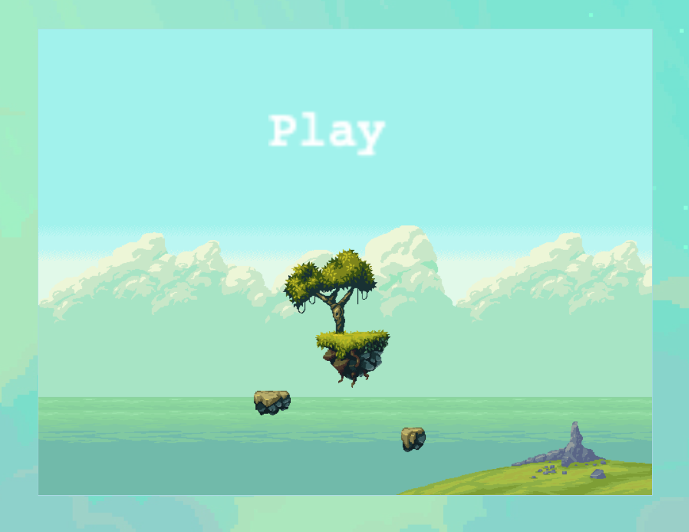
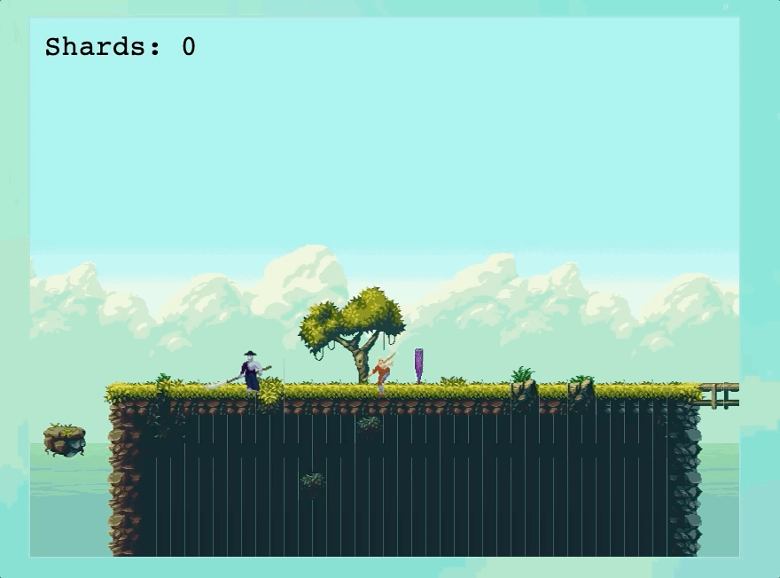
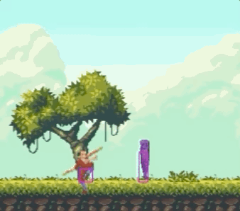
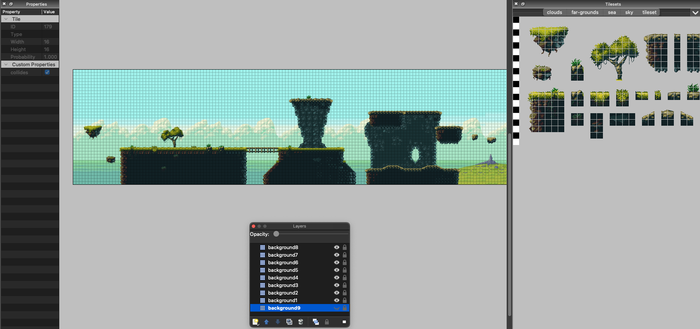

# Cloudy with a chance of monk

Find, break and collect the shard on the map to win the game!

## How to Play
| Command | Action |
|---------|-------------|
| `space` | Attack |
| `arrow keys` | Move and jump |

## Technologies Used
I chose Phaser because it is a light and easy to use JavaScript library for making web games.

* Phaser 3.50.0
* Tiled
* Node.js
* HTML
* CSS






## Challenges

* The Monk's attack
  * The attack is broken down into 2 parts:
    * The scope of the animation
      * Phaser's event called "ANIMATION_UPDATE" allows you to reference an animation within a function.

```js
createAnimationUpdate() {
  this.player.on('animationupdate', (anim, frame, sprite, frameKey) => {
    if(anim.key === 'attack1' && frame.index === 3) {
      // console.log("attack enabled on frame 3");
      this.physics.world.enable(this.attackZone);
      this.attackZone.x = this.player.x + 50;
      this.attackZone.y = this.player.y - 20;
      this.attackZone.body.height = 50;
    }
    if(anim.key === 'attack1' && frame.index === 4) {
      // console.log("attack disabling on frame 4");
      this.physics.world.disable(this.attackZone);
      this.attackZone.x = this.player.x;
      this.attackZone.y = this.player.y;
    }
  });
}
```

In this function I used the reference to an animation `anim` and a certain frame `frame`.

But a whole animation is the size of the whole player. To break it down and make sure that only the monk's wooden stick hit the shard I had to add a Phaser physics object. This is an invisible square, sized and positioned to match the movement of the monk's wooden pole.

```js
this.physics.world.enable(this.attackZone);
this.attackZone.x = this.player.x + 50;
this.attackZone.y = this.player.y - 20;
this.attackZone.body.height = 50;
```



Creating an a physics object:
```js
this.attackZone = this.add.zone(this.player.x, this.player.y, 40, 40);
```


* Creating a map that scrolls with the player
  * I learnt how to use a program called Tiled. Tiled takes images or a sheet of images and lets you create a game map. The map is exported as a json file where each layer, tile, and custom property were used in this project. You can view these in assets/map.
  * The features I used in Tiled were
      * Tilesets (images)
      * Layers (a collection of images)
      * Custom Properties (to ensure certain tiles/images were interactive with the player)

  

Create a variable which will be used to make a tilemap of the images:

```js
const map = this.make.tilemap({ key: "map"});
```

Making the tile map of the different images used in the project:

```js
const tileset = map.addTilesetImage("tileset", "tiles", 16, 16);
const cloudTile = map.addTilesetImage("clouds", "cloudsImage", 16, 16);
const farGroundsTile = map.addTilesetImage("far-grounds", "farGroundsImage", 16, 16);
const seaTile = map.addTilesetImage("sea", "seaImage", 16, 16);
const skyTile = map.addTilesetImage("sky", "skyImage", 16, 16);
```

Creating the layers that exist in the game map's json file with the images:

```js
const backgroundA = map.createLayer("background1", [seaTile, skyTile]);
const backgroundB = map.createLayer("background2", cloudTile);
const backgroundC = map.createLayer("background3", farGroundsTile);
const backgroundD = map.createLayer("background4", tileset);
const backgroundE = map.createLayer("background5", tileset);
const backgroundF = map.createLayer("background6", tileset);
const backgroundG = map.createLayer("background7", tileset);
const backgroundH = map.createLayer("background8", tileset);
const backgroundI = map.createLayer("background9", tileset);
```

Setting a collision between the player and the platform layers:
* the numbers are the tile indexes
* not sure why I have `setCollisionBetween()` and `setCollidesByProperty()`??

```js
backgroundG.setCollisionBetween(0, 475, true, 'backgroundG');
backgroundD.setCollisionBetween(0, 475, true, 'backgroundD');
backgroundH.setCollisionBetween(0, 475, true, 'backgroundH');
backgroundI.setCollisionBetween(0, 475, true, 'backgroundI');
backgroundG.setCollisionByProperty({ collides: true });
backgroundD.setCollisionByProperty({ collides: true });
backgroundH.setCollisionByProperty({ collides: true });
backgroundI.setCollisionByProperty({ collides: true });
```

## Bugs
* If you keep the spacebar pressed down, the player will keep moving upwards.
* There is no way to win the game at the moment.

## Future Plan
* My future plan is to create a story lined game where the player must defeat a few enemies before a larger final one. A health system and a power up system, so when the player collects a shard his attack or health increases.
* To clean up the code and create separate files for each game component.

## Links
